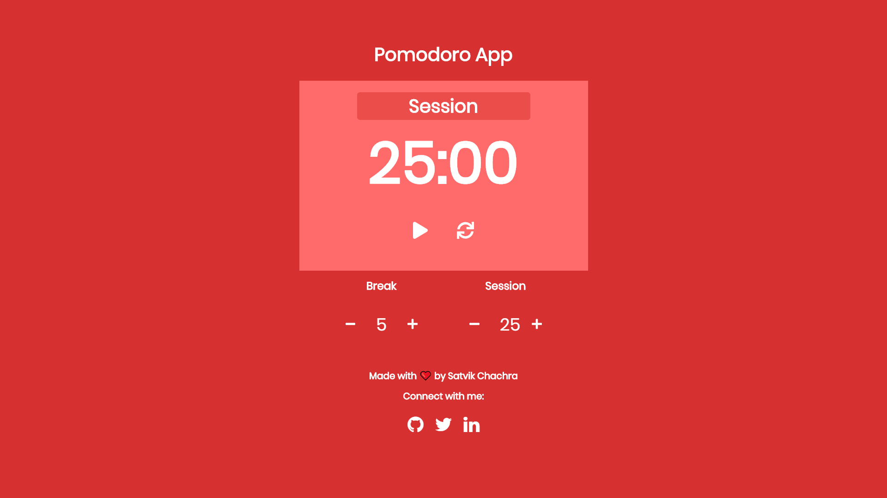
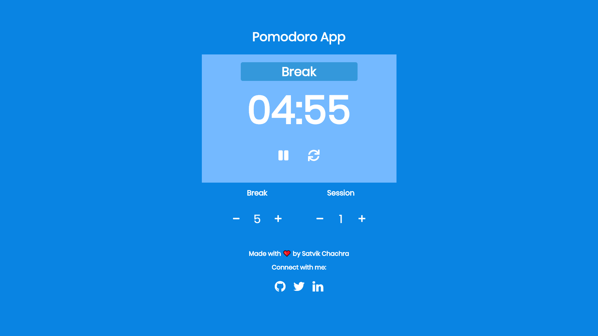

# Pomodoro Clock

* Pomodoro Clock App is a customizable pomodoro timer that works on desktop & mobile browser.
* The aim of this app is to boost your productivity.
* This app is inspired by Pomodoro Technique which is a time management method developed by Francesco Cirillo.

### View Live Demo
<pre><a href="https://satvikchachra.github.io/pomodoro-clock"><b>satvikchachra.github.io/pomodoro-clock</b></a></pre>

### Images
<details>
  <summary>Session</summary>
  
</details>

<details>
  <summary>Break</summary>
  
</details>

## Features
* Color transition to switch moods between work time and rest time
* Audio notification at the end of a timer period
* Customizable timer intervals to suit your preference


## Setup
#### Clone this repository
```bash
git clone https://github.com/satvikchachra/pomodoro-clock.git
```
#### Move to desired directory
```bash
cd pomodoro-clock
```
#### To install the dependencies
```bash
npm install
```
#### To run the app
```bash
npm start
```

## Learn More

You can learn more in the [Create React App documentation](https://facebook.github.io/create-react-app/docs/getting-started).
<br>
To learn React, check out the [React documentation](https://reactjs.org/).


##### Made with ♥ by <a href="https://github.com/satvikchachra">satvikchachra</a>

[](https://github.com/satvikchachra)

